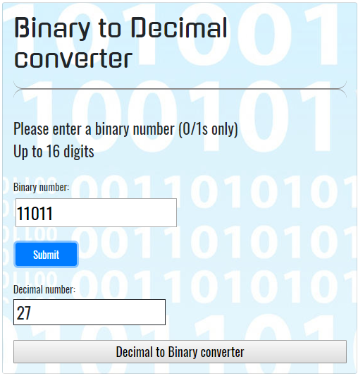
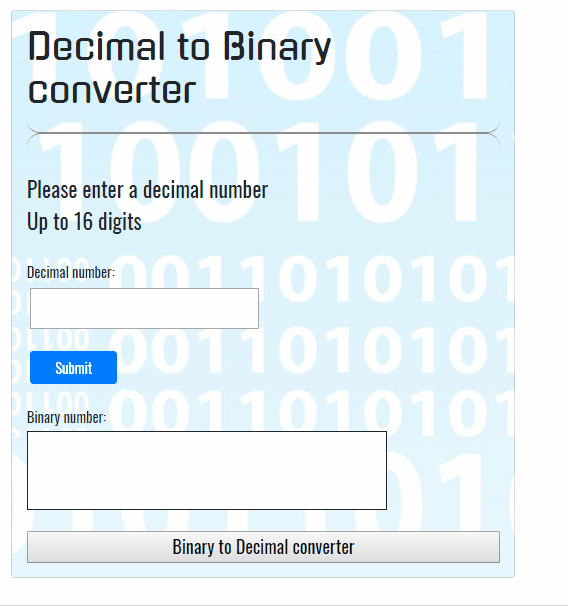

# Binary to Decimal Converter
A simple app that converts binary numbers to decimals



## About the Binary to Decimal converter:

This app takes in a binary (base 2) number from 1 to 16 digits and converts it to a decimal (base 10) number.

## Description of the problem:

This app needed to filter user input to only allow binary numbers, and convert them to the correct decimal equivalent.

## Technical Solutions:

- A regular expression pattern is used to filter user input. The pattern is ```/^[0|1]{1,}$/```. The forward slashes contain the expression. The ```^``` and ```$``` indicate that the input must start and end with the allowed characters. ```[0|1]``` indicates that only 0 and 1 are valid inputs. ```{1,}``` indicates that the input can be a minimum of 1 character long, with no maximum length.
- The regular expression is used in an if/else if/else statement to alert the user if the input is invalid or convert the number if the input was the correct format.
- A for loop is used to iterate through the user-input string. Since numbers increase in value from right to left, the for loop runs backwards, starting at the character at the position ```binaryNumber.length - 1``` (i.e. the lowest digit entered) and decrementing each time the loop is run. 
- If the digit being evaluated is a 0, it is ignored.  
- Each successive number is added to the variable ```numberMultiplier```, which is multiplied by 2 each iteration of the loop after the first digit (1) is evaluated. This results in the doubling of each successive digit compared to the previous digit. 
- The HTML field for user input was given an attribute of ```maxlength='16'```, which limits user input to 16 characters.  
- note: since JavaScript coerces variables where needed for comparison, the user input was a string rather than a number. 

## How the app is organized:

The app uses HTML for structure, CSS for styling, and JavaScript for the logic and functionality.

## How to run this app:

This app can be run from the GitHub Pages link, or downloaded to your computer and run locally. To run it locally, download the app files (HTML, JavaScript, and CSS) to a local directory, and double-click on the HTML file. It will open in your default browser. 

## Demo:



## Built with:

- JavaScript
- HTML 5
- CSS 3
- Bootstrap

## Authors:

This app was coded by me, and is maintained by me.

## Future development:

- Change error handling to something other than an alert.
- Add functionality to convert from decimal to binary.
- Add functionality to convert to/from other bases (hexadecimal...).


